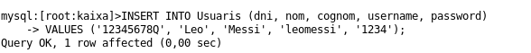
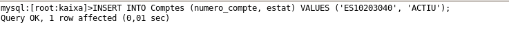

Explicacio del codi del menu de clients:

He fet servir analisi descendent, com hem fet sempre a programació. Consta d'una funcio principal que crida totes les altres.

Els metodes que he creat per el menu son els següents:

**ValidarClientABaseDeDades** Fa un SELECT id a la taula Usuaris amb el nom d'usuari i la contrasenya introduïts. Si troba l'usuari, guarda el seu id a usuariId (variable estàtica que s'utilitzarà a totes les consultes posteriors) i retorna true.

**ObtenirCompteId** Busca el id del compte a la taula Comptes fent un INNER JOIN amb UsuarisComptes per assegurar-se que el compte pertany a l'usuari autenticat (usuariId). Si no el troba, retorna 0.

**ObtenirSaldo** Consulta la vista VistaSaldos filtrant per compte_id i retorna el saldo actual. Si no hi ha resultat, retorna 0.

**InserirMoviment** Inserta una fila a Moviments amb el compte_id, l'import (negatiu si és retirada), el concepte i el nou saldo ja calculat.

**FerIngres**

Obté el compteId amb ObtenirCompteId — si és 0, para.
Obté el saldo actual amb ObtenirSaldo.
Calcula nouSaldo = saldoActual + import.
Crida InserirMoviment amb l'import positiu.

**FerRetirada** Igual que FerIngres però amb dues diferències:

Comprova que import <= saldoActual, si no, para amb "Saldo insuficient".
Crida InserirMoviment amb l'import en negatiu (-import).

**GestionarMenuClient** Bucle do/while que mostra el menú i executa el mètode corresponent segons l'opció. No surt fins que l'usuari tria l'opció 7.

Primer s'inicia sessio, si el programa detecta que l'usuari es cashbox_app i la contrasenya es app123, directament surt el menu d'administrador, pero si no, si detecta que es un dels usuaris que hi ha a la taula de la bdd, directament surt el menú de l'usuari, i directament si no detecta res, ni admin ni usuari doncs surt que les credencials son incorrectes.

El menú del client és un bucle `do/while` que va repetint-se fins que l'usuari tria l'opció 7 per sortir. Cada opció del menú crida un mètode diferent que fa una cosa concreta:

**1. Veure comptes**: mostra els comptes que té l'usuari.
**2. Consultar saldo**: mostra quants diners té a cada compte.
**3. Veure moviments**:  mostra l'historial de moviments del compte.
**4. Fer un ingrés**:  permet afegir diners a un compte.
**5. Fer una retirada**: permet treure diners, sempre que hi hagi saldo suficient.
**6. Veure alertes**: mostra les alertes que té l'usuari als seus comptes.
**7. Sortir**: surt del menú i tanca la sessió.

Una cosa important és que totes les consultes que es fan a la base de dades utilitzen el `usuariId` de l'usuari que ha fet login, això fa que cada usuari només pugui veure i modificar els seus propis comptes i no els d'un altre usuari.

ValidarClientABaseDeDades Fa un SELECT id a la taula Usuaris amb el nom d'usuari i la contrasenya introduïts. Si troba l'usuari, guarda el seu id a usuariId (variable estàtica que s'utilitzarà a totes les consultes posteriors) i retorna true.

Proves:

Creare l'usuari de prova per poder fer les diferents consultes del client
INSERT INTO Usuaris (dni, nom, cognom, username, password) VALUES ('12345678Q', 'Leo', 'Messi', 'leomessi', '1234');

Ara insertare un nou compte per poder-li afegir al usuari leomessi

Com que aquest usuari i compte es el 1,1, ja que es el primer que he creat, doncs ara fare un insert
a UsuarisComptes aixi els uniré tant el compte com l'usuari

Ara que ho tinc tot enllestit, faré un ingres desde la compte de leomessi contraseña 1234

Faig un ingrés de 100 euros al compte que he creat abans per leomessi i de moment tot correcte

Un cop fet l'ingres, faig la opcio 2 que es consultar el saldo i em surt el compte i el saldo que té.

Ara consultare els moviments, la opcio 3 i surt la data i l'hora, el numero de compte, el concepte de l'ingres, l'import que he ingresat i el saldo del compte.

Ara probarem a fer una retirada de 30 euros amb concepte de Retirada_Prova

Aixo si, com que el usuari pot tenir mes d'una compte, li demano que fiqui el numero del seu compte, si no existeix, no funciona el programa, donant d'error Compte no trobat o no autoritzat

Ara consulto un altre cop els moviments i surt igual que l'ingres pero ara la retirada de 30 euros i que em quedo amb 70 euros al compte.

Comprovacio a la maquina isard BDD

