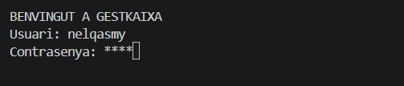
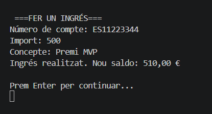
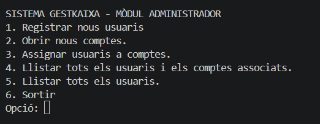
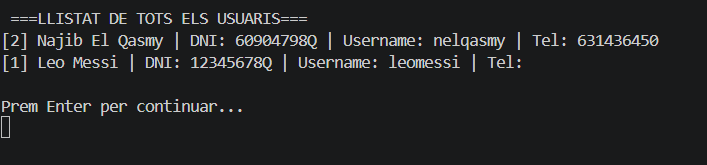
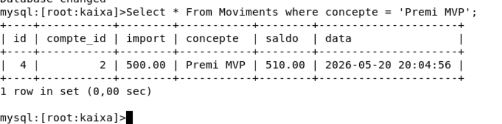
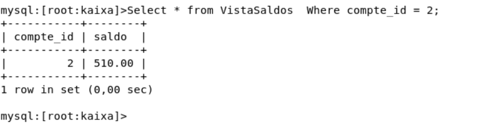

He afegit els diferents metodes per poder fer:

**Mètode LlegirPassword()**: Utilitza Console.ReadKey(true) per capturar les tecles sense mostrar-les per pantalla, imprimint un asterisc en el seu lloc.

**Mètode LlistarUsuarisIComptes()**: Executa una consulta amb LEFT JOIN per llistar tots els usuaris de la BD, mostrant el seu IBAN i el seu rol (Titular/Autoritzat).

**Mètode FerOperacio()**: Mètode unificat per a ingressos i retirades que gestiona la lògica de saldos i inserció de moviments.

He millorat el codi fent diferents **Console.Clear()**; ja que el que fa aquesta comanda es esborrar el que teies anteriorment a la consola i et posa nomes el que t'interessa, doncs aquesta es una de les millores

Proves de verificacio del programa:

Aqui comprovare que la contrasenya s'em m'oculti.

Una millora que he implementat es aquesta, la de que despres de fer un ingres/Retirada em surti un missatge dient el que has fet i el saldo que em queda despres del moviment.

He fet un canvi en el nou menú del administrador, es ficar la opcio de llistar tots els usuaris.

Aqui he afegit el nou metode que llista tots els usuaris, aixo s'ha de poder fer desde l'administrador nomes, per aixo nomes ho he ficat al menu del admin

Ara fare les comprovacions desde MySql la base de dades:

Aqui la consulta de que l'ingres s'ha fet correctament

Finalment el el saldo del compte que he fet l'ingres:

