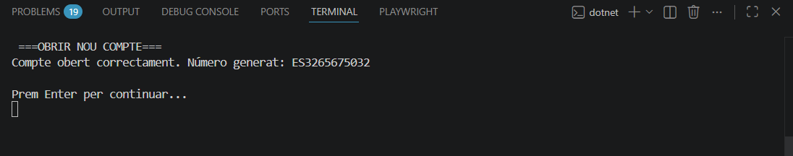
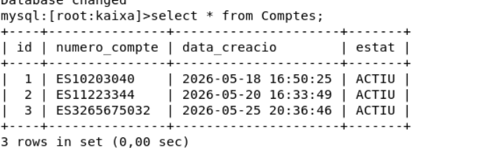

Fase 2

En aquesta fase, he millorat ficant que al obrir un compte, que es generi el numero automaticament, també he fet que el programa comprovi si hi ha un compte igual al generat, aixo fet amb un do while que fara el codi nomes si el compte generat no esta repetit.

Aqui esta la comprovacio desde el visual studio code. Al entrar desde el administrador i crear un nou compte, amb la nova millora implementada

Ara faré la comprovacio desde la maquina isard per veure si realment s'ha implementat la compte o no.

